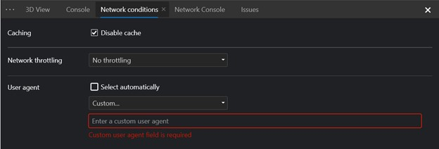
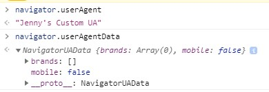
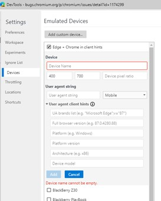
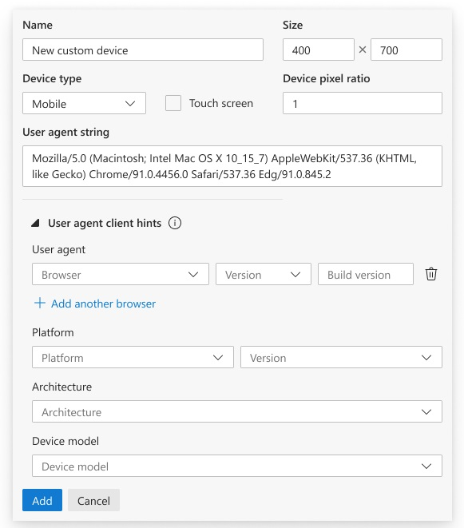

# Edit Client Hint headers 

Authors: [Erica Draud](https://github.com/erdraud)

## Status of this Document
* This document status: **Active**
* **Current version: this document**
    
## Introduction

[Client Hints](https://wicg.github.io/client-hints-infrastructure/) focus on securely enabling scalable content negotiation between the client and server through a collection of HTTP and user-agent features with a third-party delegation system. A new expansion to the Client Hints API, [User-Agent Client Hints](https://wicg.github.io/ua-client-hints/) enable developers to access information about a user's browser in a privacy-preserving and ergonomic way. The existing debugging experience for these client hints has been described as limited and “super painful” by our internal clients. Developers cannot easily modify UA Client Hints through an accessible UI, and currently the platform does not support testing custom UA Client Hints and [UA Strings](https://developer.mozilla.org/docs/Web/HTTP/Headers/User-Agent) simultaneously, an important use case for developers. This is a high priority for the Web Platform team; they want to encourage people to switch to using Client Hints over Strings as we hypothesize it will greatly improve site compatibility and code hygiene. They’ve gotten feedback that limited testing infrastructure is a large friction point in that migration, so we are taking on this work to support developers and to improve our existing UX.  

While there are many feature requests regarding UA Client Hints, the Web Platform and our team have worked together to focus on the higher impact items: 

- Address a high-impact bug: UA Client Hint headers are disappearing when custom UA strings are sent 

- Create a more intuitive experience for customizing Client Hints 

- Provide autofill for Client Hints headers to match UA string info and vice-versa 

## Goals

1. To make it easier for users to ensure CH headers are still getting sent even if custom UA is used, 

2. To limit the effort required in testing Client Hints, and 

3. To support web developers and browser detection framework teams 

We are taking on the top pain points for developers working with UA Client Hints. Their workflows bleed into the Developer Tools, so we must do our part to support them. As the Client Hints move through Chromium, we will have more and more users that will require these tools, so it’s important that we start sooner rather than later. Once we accomplish these top requests, we can address other pain points as they come up. 

## Use Cases

### Verify success of sent Client Hints headers 
 
The most desired feature for debugging Client Hints is ensuring CH headers are still getting sent even if custom UA is used. UA Client Hints were recently enabled in Chromium, which has resulted in some compatibility issues and some bugs. One inconsistency that directly impacts the UA Client Hint edit and send story is the Network Conditions UX. 

 

In Network conditions > User agent, if you select a custom or pre-canned user agent, the UA Client Hints are no longer available; the headers are not sent, `navigator.userAgentData` is still present in the DOM but the brands property is of 0 size: 
 
 

 
The expected behavior is that `sec-ua-ch headers` continue to get sent and that `navigator.userAgentData.brands` is not empty. The user also shared that “if the precanned values of “Chrome – Windows” also updated the Client Hints values to match that would substantially address [their] testing concerns.” This improvement could also benefit the associated XBOX UA experience. 

### Customize UA Client Hints set-up 

 
In the DevTools Settings > Devices, there is a feature where users can add custom devices, which enables users to send user agent client hints. The current experience forces users to define every single value in the “User agent client hints” section to send any at all.  

Users want the option to choose which hints to customize such that the remaining fields will just be the value that would have been sent.  

## Proposed Solution

### Emulated Devices

We will be re-working the User agent client hints UI to be cleaner and easier to use. The form will use grouping for both accessibility and clarity. and we'll use drop-downs to lessen the users burden. Users also won't have to submit every element and will have the guidance of default suggestions. These default will replace the gray text within the form elements shown below.

While the design does include changes in other parts of the Devices pane, that is out of scope. We will prioritize accessibility issues there and then investigate if other UI changes should be made there.

### Network conditions

While investigating the [header bug](https://bugs.chromium.org/p/chromium/issues/detail?id=1174299), we also noticed that the UI was lacking. To enter a custom user agent, the developer must type it in a specific string format. To help users navigate this form, we will add the proposed UI for the Devices pane into the Network conditions tool, too.  

## Q&A

**Q: Will we need to make changes to the CDP (Chrome Dev Protocol)?**

A: No

**Q: Are the client hints displayed in the Emulated Devices pane the only hints available or are there other options that aren’t displayed?**

A: The list in the device emulation view is the complete set of UA Client Hints

**Q: Are all the hint inputs currently required because HTTP needs to be sent with all of the header items?**

A: No, it's fine if some of the headers are undefined.

**Q: For emulated devices (not the current device), where would auto-fill pull from?**

A: For *emulated devices that are built-in*, ideally there would be an auto-mapping of characteristics. For example, an Android phone would use the same UA brands list as on desktop, but it would need a hardcoded value for model info (e.g. the UA string baked into DevTools might have been “Nexus 5 Build/MRA58N” but would now need to report a similar string in the Sec-CH-UA-Model hint). For iPhone emulation, it would ideally drop all of the hints by default since UA Client Hints aren’t available for iPhone at all.

For a *custom device* (or an edited one…), ideally an empty string for one of the UA Clients Hints fields would map to “send whatever the browser would have done otherwise”. 

**Q: Do we need to add default client hints to the existing emulation library for this or for future use cases?**

A: Yes, I think the emulation library should be upgraded to actually understand Client Hints.
