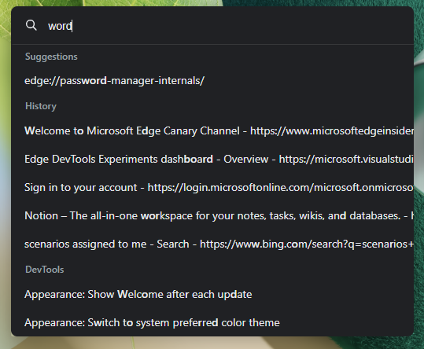
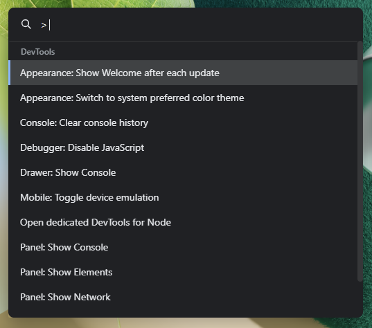
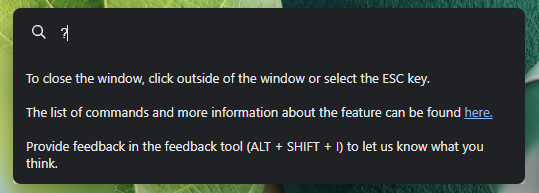

# DevTools:Command Palette

Authors:
 - [Erica Draud](https://github.com/erdraud), Program Manager

## Feature status
This feature is in Canary 105.

## Introduction
We have evolved our [Omnibox Commands](https://github.com/MicrosoftEdge/DevTools/blob/main/explainers/Omnibox/explainer.md) experiment into the Command Palette, which is now available in Canary under a feature flag. We are excited to make DevTools and browser commands available to users in a streamlined and comprehensive platform. We've pulled some of the commands you can find in the [Command Menu]( https://docs.microsoft.com/microsoft-edge/devtools-guide-chromium/command-menu/) in DevTools, but why have these features in the browser? We know that users are often looking for ways to streamline their browsing or programming workflow, and the Command Palette enables users to do so without having to first open the Developer Tools or go down a long chain of settings or context menus. 

To try it out today, head to [edge://flags](edge://flags) and enable the Command Palette experiment. Once it's enabled, use the keyboard shortcut `CTRL+SHIFT+SPACE` to turn it on. Let us know what you think; your suggestions just might be in the next version!

## Goals
  1.	To simplify DevTools users’ workflow and
  2.	Identify opportunities for expansion

## Features

### Home menu

When the feature opens, there will be a search bar with text that prompts the user to try using different keywords to search for their command. 

### DevTools

Typing `>` will pull up the available commands for DevTools. These commands were pulled from the DevTools Command Menu. Enable Device Mode was prioritized since we’ve had direct feedback for this functionality. Most of the commands are opening panels or changing the appearance or theme of the DevTools. To access the existing commands, you can find them in the [DevTools commands](#devtools-commands) section.

### Help

If the user types a question mark `?`, we will display a short text in the drop-down menu area explaining the feature and a link to the documentation page. It will include all the command segments they can type in in case they missed it the first time they opened it.

### Search
By typing a keyword, the menu options will display all the possible commands with the string provided. The search results will be segmented by their related category, whether it's DevTools or one of the many browser categories.
If an option is unavailable, `No command found` will appear in the UI meant for search results.

### URL
To easily access internal URLs, you can type in `edge`. This will pull up a list of all the Edge internal URLs. To access the existing URLs, click [here](#available-urls).

## Next steps
* Complete rollout

## Things to consider
* Commands shouldn't conflict with search engine searches

## FAQ:
Q: Does it have extensibility so other could add in additional commands?

A: Not in scope for this experiment, but a great idea for the future.

Q: Will this require a totally separate implementation vs. upstream? or hook into theirs?

A: We will be integrating directly into the Omnibox, not hooking into the upstream Commander.

Q: Is there an "all" option? Will customers know to use `?` and `>`?

A: We will be working with the omnibox team to clarify the best characters or strings to trigger the DevTools commands.

Q: If this is integrated into the address bar, will they know to type `?` to get help on the commands that are available?

A: We recognize there will be discoverability challenges, and we will be exploring that as we go.

Q: Are we planning to add a toggle or setting in browser settings that enable this feature after the rollout?

A: That could be a future option, but it is not in scope.

Q: Are these commands going to be available for puppeteer and/or playwright?

A: That is out of scope for this project.

Q: Some actions do trigger opening DevTools. Is it in or out of scope to be able to complete actions without opening DevTools?

A: These commands will open DevTools and conduct the requested action. The benefit is that this will be done without the user having to open the DevTools first to speed up their workflow.

## Available URLs
* edge://about/
* edge://accessibility/
* edge://appcache-internals/
* edge://application-guard-internals/
* edge://apps/
* edge://autofill-internals/
* edge://blob-internals/
* edge://bluetooth-internals/
* edge://collected-cookies-dialog/
* edge://compat/
* edge://components/
* edge://conflicts/
* edge://conversion-internals/
* edge://crashes/
* edge://credits/
* edge://data-viewer
* edge://device-log/
* edge://discards/
* edge://download-internals/
* edge://downloads/
* edge://edge-dip-internals/
* edge://edge-urls/
* edge://extensions/
* edge://favorites/
* edge://flags/
* edge://floc-internals/
* edge://gcm-internals/
* edge://gpu/
* edge://help/
* edge://histograms/
* edge://history/
* edge://indexeddb-internals/
* edge://inspect/
* edge://interstitials/
* edge://invalidations/
* edge://local-state
* edge://management/
* edge://media-engagement/
* edge://media-internals/
* edge://net-export/
* edge://net-internals/
* edge://network-error/
* edge://newtab/
* edge://ntp-tiles-internals/
* edge://omnibox
* edge://password-manager-internals/
* edge://policy/
* edge://predictors/
* edge://prefs-internals/
* edge://print/
* edge://process-internals/
* edge://push-internals/
* edge://quota-internals/
* edge://sandbox/
* edge://serviceworker-internals/
* edge://settings/
* edge://signin-internals/
* edge://site-engagement/
* edge://sync-internals/
* edge://system/
* edge://terms/
* edge://tracing/
* edge://translate-internals/
* edge://ukm/
* edge://usb-internals/
* edge://user-actions/
* edge://version/
* edge://web-app-internals/
* edge://webrtc-internals/
* edge://webrtc-logs/
* edge://whats-new/

## DevTools commands
* Appearance: Show Welcome after each update
* Appearance: Switch to system preferred color theme
* Console: Clear console history
* Debugger: Disable JavaScript
* Drawer: Show Console
* Mobile: Toggle device emulation
* Open dedicated DevTools for Node
* Panel: Show Console
* Panel: Show Elements
* Panel: Show Network
* Panel: Show Sources
* Sources: Show Snippets
